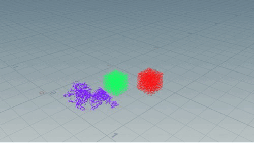
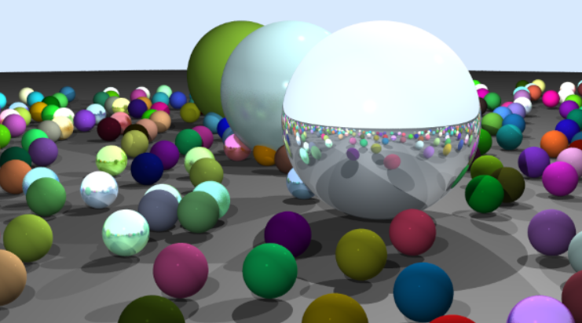

## chenhui-lib
A graphics library with multi-thread acceleration including rendering, physical simulation and a little numerical analysis.

## Features
For now(2023.3) there are the following parts:
- MyRenderer: Based on no external libs, Reproducing algorithms in book  "Fundamentals of Computer Graphics" (chapter 1 - 7 for now)
  - Ray tracing
  - multi-material setting for different objects(Blinn-Phong,Mirror reflection, Glossy Reflection,...)
  - Ray-objects intersection
  - ...
- Physics: Material point methods which is a simulator of multi-material from fluid, dynamic solids to rigid solids.
  - Consitution Model setting
  - Material setting
  - MPM transfer scheme(APIC, FLIP99)
  - TBB acceleration
  - ...
- Math: Some of numerical algorithms.(for now : SVD, Jaccobi Iter for Linear system)
- Renderer: A system to real time visualize the result of physical simulator, which is based on OpenGL3.3.
  - Camera system which can be freely controlled by keyboard and mouse just like FPS games.
  - Shader interface where different objects can be shadered independently

## Results
### Fluid mpm exported to Houdini

### Solid mpm exported to Houdini

### Simple Ray tracing

